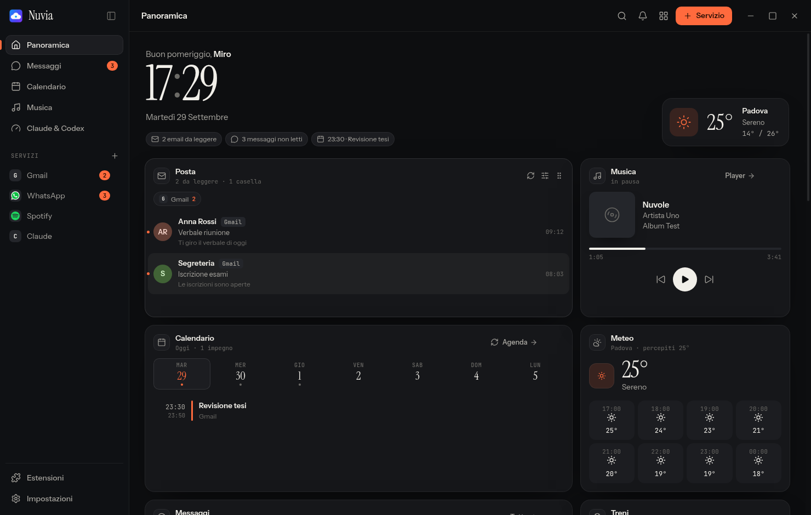
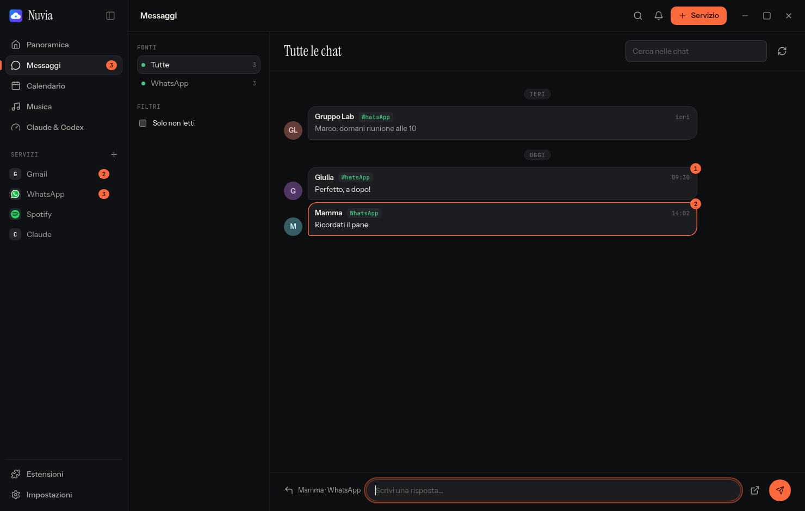
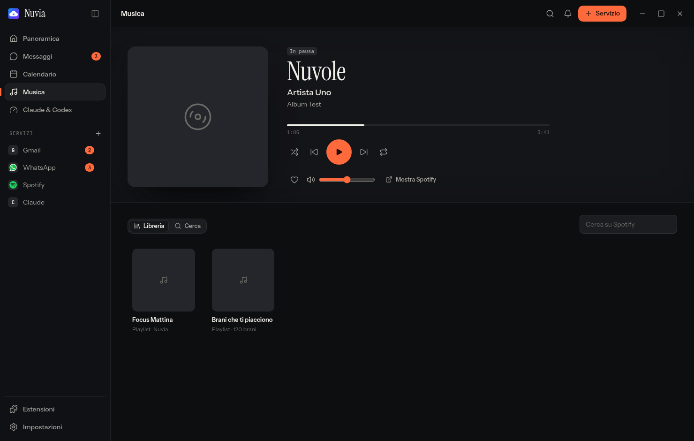
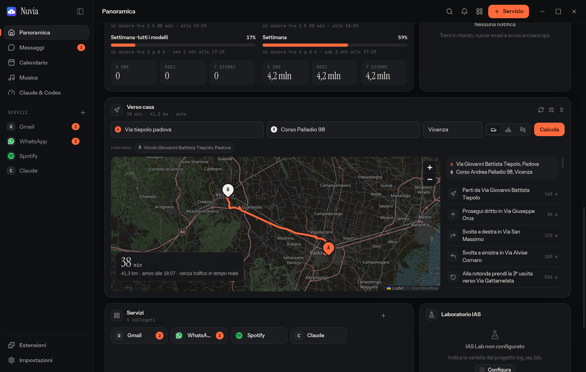
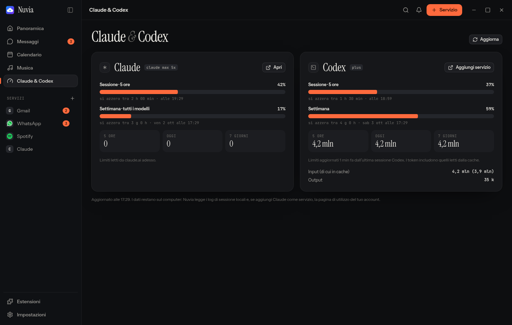

# Nuvia

Tutti i tuoi servizi web in una finestra: Gmail, Outlook, WhatsApp, Telegram, Mattermost, Spotify, Notion, Claude, Codex e qualsiasi altro sito. Ogni servizio ha un profilo separato e persistente, così fai il login una volta sola. Una panoramica configurabile riunisce posta, agenda, chat, musica e altro.

Funziona su **Windows 10/11**, **macOS** (Apple Silicon e Intel) e **Linux** (Ubuntu, Debian, Fedora e qualsiasi distribuzione tramite AppImage).



## Scarica

Le ultime versioni sono nella pagina **[Releases](https://github.com/mirovix/nuvia/releases/latest)**.

| Sistema | File | Note |
| --- | --- | --- |
| Windows 10/11 (64 bit) | `Nuvia-Setup-<versione>.exe` | Installer. In alternativa `Nuvia-<versione>-portable.exe`, che non richiede installazione. |
| macOS Apple Silicon (M1/M2/M3/M4) | `Nuvia-<versione>-mac-arm64.dmg` | |
| macOS Intel | `Nuvia-<versione>-mac-x64.dmg` | |
| Ubuntu / Debian / Mint | `Nuvia-<versione>-amd64.deb` | |
| Fedora / openSUSE / RHEL | `Nuvia-<versione>-x86_64.rpm` | |
| Qualsiasi Linux | `Nuvia-<versione>-x86_64.AppImage` | Nessuna installazione. |

`SHA256SUMS.txt` contiene le impronte dei file, per verificare i download.

## Installazione

### Windows

1. Scarica ed esegui `Nuvia-Setup-<versione>.exe`.
2. L'app non ha una firma digitale, quindi Windows SmartScreen potrebbe mostrare "Windows ha protetto il PC". Clicca **Ulteriori informazioni → Esegui comunque**.
3. Nuvia compare nel menu Start e sul desktop.

### macOS

1. Apri il `.dmg` adatto al tuo Mac e trascina **Nuvia** in **Applicazioni**.
2. L'app non è notarizzata da Apple. La prima volta aprila con **clic destro → Apri → Apri**. Se macOS dice che l'app "è danneggiata", sblocca la quarantena dal Terminale:

   ```bash
   xattr -dr com.apple.quarantine /Applications/Nuvia.app
   ```

### Linux

**Ubuntu / Debian**

```bash
sudo apt install ./Nuvia-<versione>-amd64.deb
```

**Fedora / RHEL**

```bash
sudo dnf install ./Nuvia-<versione>-x86_64.rpm
```

**AppImage (qualsiasi distribuzione)**

```bash
chmod +x Nuvia-<versione>-x86_64.AppImage
./Nuvia-<versione>-x86_64.AppImage
```

Su Ubuntu 22.04 e successive, se l'AppImage non parte, installa `libfuse2`: `sudo apt install libfuse2`.

## Cosa fa

- **Panoramica** con blocchi da mostrare, ordinare (trascinandoli dalla maniglia) e ridimensionare, ognuno con le sue opzioni.
- **Posta**: anteprima delle nuove email di Gmail e Outlook; un clic apre il messaggio.
- **Messaggi**: WhatsApp, Telegram e Mattermost in un'unica conversazione cronologica, con risposta rapida.
- **Calendario**: agenda unica da Google Calendar, Outlook e link iCal.
- **Musica**: player interno basato su Spotify Web, con copertina, artista, album, avanzamento, volume, libreria e ricerca. Non apre l'app di Spotify.
- **Verso casa**: percorso con partenza A e arrivo B su mappa, indicazioni in italiano, auto, bici o a piedi. Gli indirizzi vengono verificati sulla città indicata.
- **Claude & Codex**: quanto del limite di 5 ore e di quello settimanale hai usato, quando si azzerano e quanti token hai consumato.
- **Notifiche** con pannello e cancellazione, **meteo**, **treni** (ViaggiaTreno), **Notion**.
- Estensioni dal Chrome Web Store, attivabili servizio per servizio.
- Tema scuro, chiaro o di sistema, sei colori d'accento, sfondi e barra laterale compatta.
- Scorciatoie: `Ctrl/⌘+1…9` servizi, `Ctrl/⌘+0` panoramica, `Ctrl/⌘+K` vai a…, `Ctrl/⌘+R` ricarica, `Ctrl/⌘+,` impostazioni.

| | |
| --- | --- |
|  |  |
|  |  |

## Privacy

- Nuvia non legge né memorizza le password. Il login resta nel profilo Chromium locale di ogni servizio, sul tuo computer.
- Anteprime di posta e chat, agenda e stato del player vengono lette dalle pagine dei servizi già aperte in Nuvia. Non passano da nessun server esterno.
- **Claude & Codex** legge i log di sessione locali di Claude Code (`~/.claude`) e Codex (`~/.codex`). Se aggiungi Claude come servizio, legge anche la pagina di utilizzo del tuo account claude.ai. Nessuna credenziale viene letta.
- Le estensioni non vengono mai caricate nell'interfaccia di Nuvia, solo nei servizi in cui le attivi.

## Estensioni

Dal pulsante **Estensioni** cerchi nel Chrome Web Store e installi con un clic. Ogni estensione si attiva di default solo sui servizi a cui si rivolge: Streak, per esempio, solo su Gmail. Puoi accenderla o spegnerla per ogni servizio.

Electron supporta solo una parte delle API di Chrome. Se un'estensione fa chiudere Nuvia, o fa cadere più volte un servizio, viene disattivata su quel servizio e ricevi una notifica.

## Note

- **Spotify e contenuti protetti**: Nuvia usa [Electron for Content Security](https://github.com/castlabs/electron-releases) (castlabs), con Widevine. Su Windows e macOS alcuni servizi di streaming richiedono una firma VMP di castlabs per riprodurre contenuti protetti. Le build pubblicate non la includono, quindi su quei sistemi la riproduzione potrebbe non partire.
- **Integrazioni facoltative**: *IAS Lab* (registrazione ai laboratori DEI) e *Ritardometro* si configurano in **Impostazioni → Integrazioni**, indicando le cartelle dei rispettivi progetti. IAS Lab richiede le variabili d'ambiente `DEI_USER` e `DEI_PASSWORD` e Python.
- I dati dell'app si trovano in `%APPDATA%\nuvia-desktop` (Windows), `~/Library/Application Support/nuvia-desktop` (macOS) e `~/.config/nuvia-desktop` (Linux).

## Sviluppo

Servono Node.js 22 e git.

```bash
git clone https://github.com/mirovix/nuvia.git
cd nuvia
npm install
npm start
```

### Test

```bash
npm test                  # unitari: indirizzi, percorsi, iCal, parser, consumi, estensioni
npm run test:ui           # end-to-end su ogni pagina e pulsante, con servizi simulati (Linux + xvfb)
npm run test:integration  # contro i servizi reali: rete, Chrome Web Store, Spotify DRM, WhatsApp
```

### Pacchetti

```bash
npm run pack:linux   # AppImage, deb, rpm, tar.gz
npm run pack:win     # installer NSIS e versione portable
npm run pack:mac     # dmg e zip (solo da macOS)
```

### Pubblicare una versione

Aggiorna `version` in `package.json`, poi:

```bash
git tag v0.6.0
git push origin v0.6.0
```

Il workflow [Release](.github/workflows/release.yml) compila su Linux, Windows e macOS e pubblica tutti i file in una nuova Release.

## Crediti

[Electron](https://www.electronjs.org/) (build castlabs ECS), [Leaflet](https://leafletjs.com/) e © [OpenStreetMap](https://www.openstreetmap.org/copyright), geocoding [Nominatim](https://nominatim.org/), percorsi [OSRM](https://project-osrm.org/) su server FOSSGIS, meteo [Open-Meteo](https://open-meteo.com/), icone [Lucide](https://lucide.dev/) (ISC), font Instrument Sans e Instrument Serif e JetBrains Mono (SIL OFL). Dettagli in [THIRD_PARTY.md](THIRD_PARTY.md).
