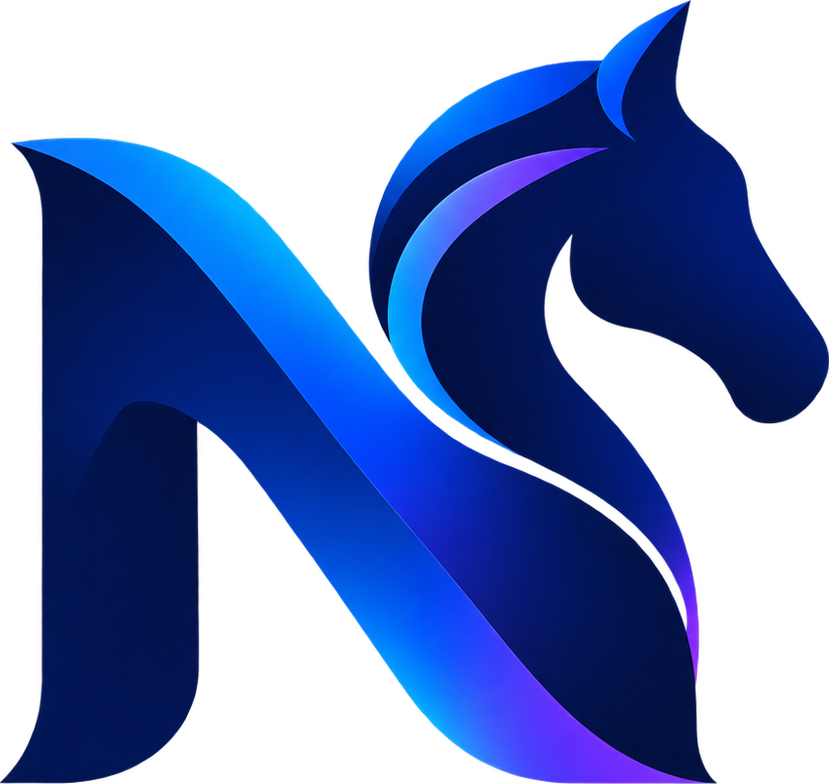
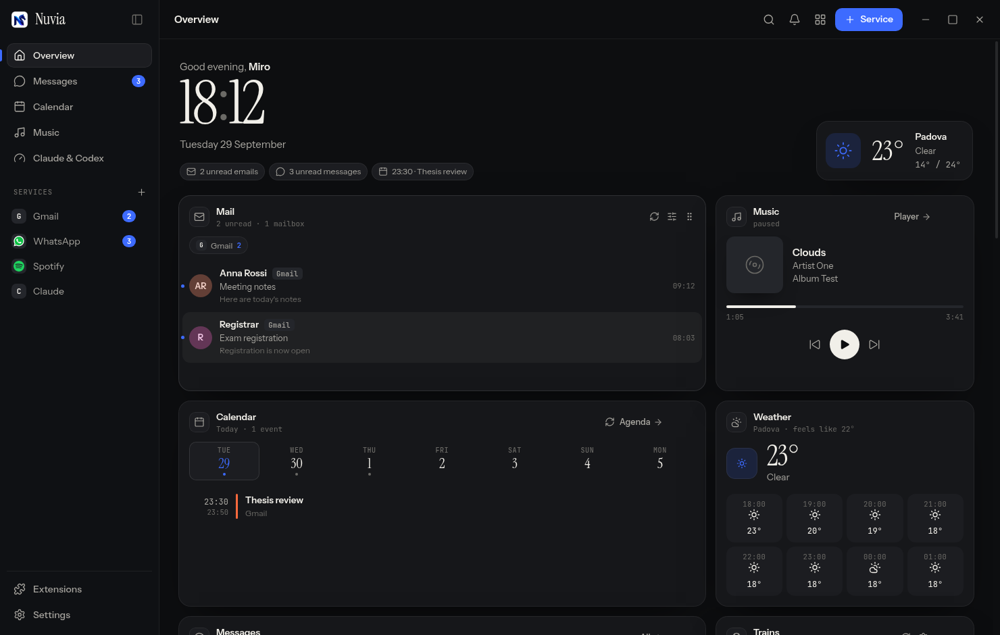
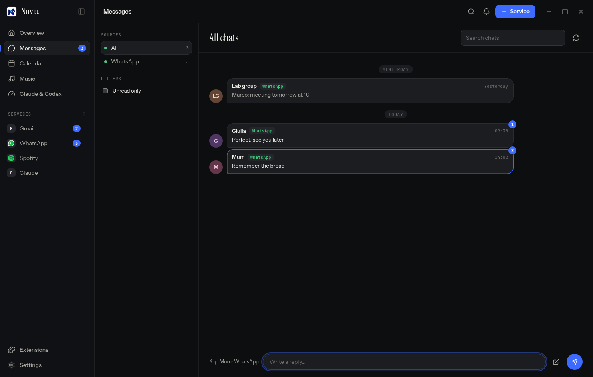
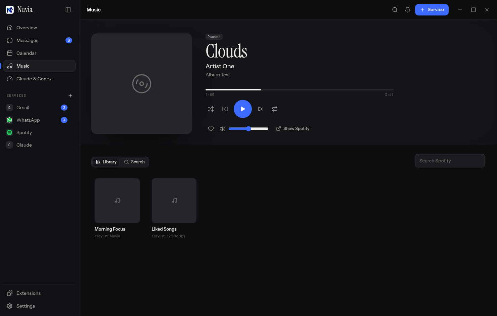
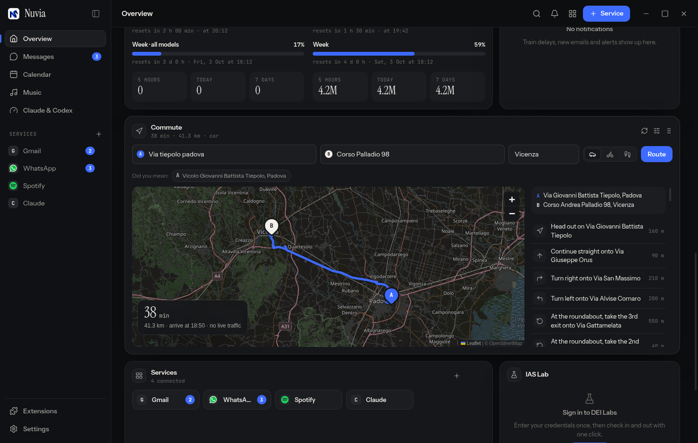
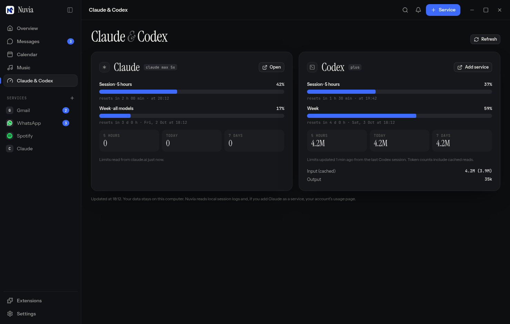

<p align="center"></p>

<h1 align="center">Nuvia</h1>

<p align="center">All your web apps in one window: mail, chats, calendar, music and more, with sessions that stay signed in.<br>
Windows · macOS · Linux</p>

<p align="center"><a href="https://github.com/mirovix/nuvia/releases/latest"><b>Download the latest release</b></a></p>



Nuvia runs Gmail, Outlook, WhatsApp, Telegram, Mattermost, Spotify, Notion, Claude, Codex and any other website side by side. Each one lives in its own persistent profile, so you sign in once. A customizable overview brings together new mail, your agenda, every chat, what's playing and your commute.

## Download

Every build is on the **[Releases page](https://github.com/mirovix/nuvia/releases/latest)**.

| System | File | Notes |
| --- | --- | --- |
| Windows 10 / 11 (64-bit) | `Nuvia-Setup-<version>.exe` | Installer. `Nuvia-<version>-portable.exe` runs without installing. |
| macOS, Apple Silicon (M1–M4) | `Nuvia-<version>-mac-arm64.dmg` | |
| macOS, Intel | `Nuvia-<version>-mac-x64.dmg` | |
| Ubuntu / Debian / Mint | `Nuvia-<version>-amd64.deb` | |
| Fedora / openSUSE / RHEL | `Nuvia-<version>-x86_64.rpm` | |
| Any Linux | `Nuvia-<version>-x86_64.AppImage` | No install needed. |

`SHA256SUMS.txt` lists the checksums of every file.

## Install

### Windows

1. Download and run `Nuvia-Setup-<version>.exe`.
2. The app isn't code-signed yet, so SmartScreen may say "Windows protected your PC". Click **More info → Run anyway**.
3. Nuvia appears in the Start menu and on the desktop.

### macOS

1. Open the `.dmg` for your Mac and drag **Nuvia** into **Applications**.
2. The app isn't notarized by Apple yet. The first time, right-click it and choose **Open → Open**. If macOS says the app "is damaged", clear the quarantine flag:

   ```bash
   xattr -dr com.apple.quarantine /Applications/Nuvia.app
   ```

### Linux

**Ubuntu / Debian**

```bash
sudo apt install ./Nuvia-<version>-amd64.deb
```

**Fedora / RHEL**

```bash
sudo dnf install ./Nuvia-<version>-x86_64.rpm
```

**AppImage (any distribution)**

```bash
chmod +x Nuvia-<version>-x86_64.AppImage
./Nuvia-<version>-x86_64.AppImage
```

On Ubuntu 22.04 and later the AppImage needs `libfuse2` (`sudo apt install libfuse2`).

**Any distribution, no root (`.tar.gz`)**

```bash
mkdir -p ~/.local/opt && tar -xzf Nuvia-<version>-x64.tar.gz -C ~/.local/opt && mv ~/.local/opt/Nuvia-<version>-x64 ~/.local/opt/Nuvia
~/.local/opt/Nuvia/nuvia-desktop
```

### Updates

Install once: after that Nuvia updates itself. Every few hours it checks the
[latest release](https://github.com/mirovix/nuvia/releases/latest); when there is a
new version it downloads it in the background, checks its SHA-256 against
`SHA256SUMS.txt` and installs it the next time you restart Nuvia (or right away
with **Restart now** in the top bar). The previous version is kept next to it
(`Nuvia.old`) in case you need to go back.

| Install | Updates |
| --- | --- |
| Windows installer, portable `.exe` | automatic |
| macOS `.app` in Applications | automatic |
| Linux AppImage, `.tar.gz` folder | automatic |
| Linux `.deb` / `.rpm` | Nuvia tells you and opens the download (the system owns those files) |

Turn it off in **Settings → General → Update automatically**; check by hand in **Settings → About**.

## Features

- **Overview** made of widgets you can show, reorder (drag them by the handle), resize and configure one by one.
- **Mail**: previews of new Gmail and Outlook messages; one click opens the thread.
- **Messages**: WhatsApp, Telegram, Mattermost and Microsoft Teams in a single timeline that reads like one chat, with quick replies. Teams keeps its Microsoft sign-in inside Nuvia and can share your screen.
- **Calendar**: one agenda from Google Calendar, Outlook and any iCal link.
- **Music**: a built-in player on top of Spotify Web, with artwork, artist, album, progress, volume, library and search. It never opens the Spotify app.
- **Stays signed in**: services that sign you out every few hours (a university Google Workspace, Microsoft 365) sign back in by themselves after you log in once; you get a notification when a second factor is needed.
- **Commute**: route from A to B on a map, turn-by-turn directions, by car, bike or on foot. Addresses are checked against the city you typed. Map tiles are cached on disk and fetched as OpenStreetMap's tile policy asks, with backup map servers if one refuses.
- **Live traffic** (optional): add a free TomTom key in Settings → Integrations and the commute shows the real delay and arrival time instead of free-flow. Without a key Nuvia says nothing about traffic rather than guessing.
- **Claude & Codex**: how much of the 5-hour and weekly limits you've used, when they reset, and how many tokens you've spent.
- **Notifications** panel, **weather**, Italian **trains** (ViaggiaTreno, with delay alerts) and **Notion** shortcuts.
- Chrome Web Store **extensions**, enabled per service.
- Dark, light or system theme, seven accent colours, backgrounds and a compact sidebar.
- **Time zone**: pick the one you are in (Settings → General); the clock, calendar, mail and message times follow it at once.
- Shortcuts: `Ctrl/⌘+1…9` services, `Ctrl/⌘+0` overview, `Ctrl/⌘+K` go to…, `Ctrl/⌘+R` reload, `Ctrl/⌘+,` settings.

| | |
| --- | --- |
|  |  |
|  |  |

## Privacy

- **Stay signed in** (on by default, Settings → General): when you sign in on a service's sign-in page (Google, a university single sign-on, Microsoft), Nuvia keeps that email and password encrypted with the system keychain and uses them only to sign that service back in when its session expires. Nothing is stored on any other page, and you can remove the saved sign-in per service in Edit service. Otherwise each login stays in a local Chromium profile on your computer.
- Session-only cookies (for example a university single sign-on) are kept across restarts, encrypted with the system keychain, like Chrome does when it reopens your tabs.
- Mail and chat previews, the agenda and the player state are read from the service pages already open in Nuvia. Nothing goes through a third-party server.
- **Claude & Codex** reads the local session logs of Claude Code (`~/.claude`) and Codex (`~/.codex`). No credentials are read.
  - *Codex* limits are asked live from the Codex CLI (`codex app-server`), one set of bars per account, and shown like Codex shows them: what is **left** in each window (5 hours, week, or month on the free plan). Codex keeps one login per folder: sign in another account once with `CODEX_HOME=~/.codex-work codex login` and every `~/.codex-*` folder shows up on its own.
  - *Claude* limits come from your claude.ai usage page if you add Claude as a service, otherwise from the copy Claude Code keeps of them in `~/.claude.json` (refreshed while it runs, in the terminal or in VS Code; only that entry is read). For the terminal, **Show limits from Claude Code** can also add a status line that prints `5h 23% · 7d 41%`; it never replaces a status line you already have and keeps a backup of `settings.json`.
- Extensions are never loaded into Nuvia's own interface, only into the services where you enable them.

## Extensions

Search the Chrome Web Store from **Extensions** and install with one click. By default an extension is enabled only on the services it targets (Streak, for example, only on Gmail), and you can switch it on or off per service.

Electron supports a subset of the Chrome extension APIs. If an extension crashes Nuvia, or crashes a service repeatedly, Nuvia disables it on that service and tells you.

## Integrations

Two optional integrations for the University of Padova, both configured in **Settings → Integrations**:

- **IAS Lab (DEI Labs)**: check in to and out of a DEI lab with one click. Nuvia asks for your DEI credentials once, keeps the session and stores the password encrypted in the system keychain. Based on [log_ias_lab](https://github.com/mirovix/log_ias_lab).
- **Trains (Ritardometro)**: live departures from your station towards the destinations you pick, plus a notification when a watched train is late. The first configuration is imported from [ritardometro](https://github.com/mirovix/ritardometro).

## Notes

- **Spotify and DRM**: Nuvia is built on [Electron for Content Security](https://github.com/castlabs/electron-releases) by castlabs, which ships Widevine. On Windows and macOS some streaming services also require castlabs VMP signing to play protected content. The published builds aren't VMP-signed, so playback may not start on those systems.
- **App data** lives in `%APPDATA%\nuvia-desktop` (Windows), `~/Library/Application Support/nuvia-desktop` (macOS) and `~/.config/nuvia-desktop` (Linux).

## Development

You need Node.js 22 and git.

```bash
git clone https://github.com/mirovix/nuvia.git
cd nuvia
npm install
npm start
```

### Tests

```bash
npm test                  # unit: addresses, routing, iCal, parsers, usage, extensions
npm run test:ui           # end-to-end on every page and button, with simulated services (Linux + xvfb)
npm run test:integration  # against the real services: network, Chrome Web Store, Spotify DRM, WhatsApp
```

### Packages

```bash
npm run pack:linux   # AppImage, deb, rpm, tar.gz
npm run pack:win     # NSIS installer and portable exe
npm run pack:mac     # dmg and zip (macOS only)
```

### Releasing

Bump `version` in `package.json`, then:

```bash
git tag v0.6.0
git push origin v0.6.0
```

The [Release workflow](.github/workflows/release.yml) builds on Linux, Windows and macOS and publishes every file to a new GitHub Release.

## Credits

[Electron](https://www.electronjs.org/) (castlabs ECS build), [Leaflet](https://leafletjs.com/) and © [OpenStreetMap](https://www.openstreetmap.org/copyright) contributors, [Nominatim](https://nominatim.org/) geocoding, [OSRM](https://project-osrm.org/) routing on FOSSGIS servers, [Open-Meteo](https://open-meteo.com/) weather, [Lucide](https://lucide.dev/) icons (ISC), Instrument Sans, Instrument Serif and JetBrains Mono fonts (SIL OFL). Details in [THIRD_PARTY.md](THIRD_PARTY.md).
